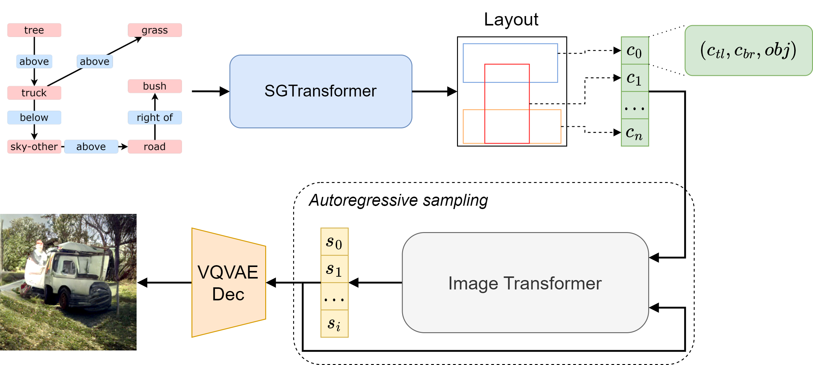

    
 
# Transformer-Based Scene Graph to Image
[Renato Sortino](https://github.com/rensortino), [Simone Palazzo](https://github.com/simopal6) and Concetto Spampinato

## Overview   
Official PyTorch implementation of the paper __"[Transformer-Based Image Generation from Scene Graphs](https://arxiv.org/abs/2303.04634)"__.

 

## Abstract
>Graph-structured scene descriptions can be efficiently used in generative models to control the composition of the generated image. Previous approaches are based on the combination of graph convolutional networks and adversarial methods for layout prediction and image generation, respectively. In this work, we show how employing multi-head attention to encode the graph information, as well as using a transformer-based model in the latent space for image generation can improve the quality of the sampled data, without the need to employ adversarial models with the subsequent advantage in terms of training stability. The proposed approach, specifically, is entirely based on transformer architectures both for _encoding_ scene graphs into intermediate object layouts and for _decoding_ these layouts into images, passing through a lower dimensional space learned by a vector-quantized variational autoencoder. Our approach shows an improved image quality with respect to state-of-the-art methods as well as a higher degree of diversity among multiple generations from the same scene graph.  We evaluate our approach on three public datasets: Visual Genome, COCO, and CLEVR. We achieve an Inception Score of **13.7** and **12.8**, and an FID of **52.3** and **60.3**, on COCO and Visual Genome, respectively. We perform ablation studies on our contributions to assess the impact of each component.

  

## Results
#### On COCO compared to SOTA models

 

#### Analysis on the robustness of the model to input perturbations

