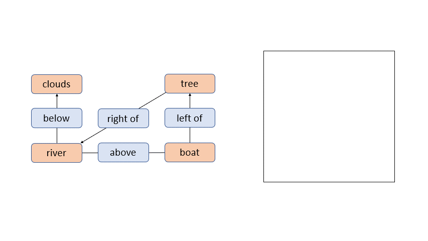

<div align="center">    
 
# Transformer-Based Scene Graph to Image
[Renato Sortino](https://github.com/rensortino), [Simone Palazzo](https://github.com/simopal6), and [Concetto Spampinato](https://github.com/cspampin)

[](https://arxiv.org/abs/2303.04634)

</div>

## Overview   
Official PyTorch implementation of the paper __"[Transformer-Based Image Generation from Scene Graphs](https://arxiv.org/abs/2303.04634)"__.
<div align=center></div>

## Abstract
>Graph-structured scene descriptions can be efficiently used in generative models to control the composition of the generated image. Previous approaches are based on the combination of graph convolutional networks and adversarial methods for layout prediction and image generation, respectively. In this work, we show how employing multi-head attention to encode the graph information, as well as using a transformer-based model in the latent space for image generation can improve the quality of the sampled data, without the need to employ adversarial models with the subsequent advantage in terms of training stability. The proposed approach, specifically, is entirely based on transformer architectures both for _encoding_ scene graphs into intermediate object layouts and for _decoding_ these layouts into images, passing through a lower dimensional space learned by a vector-quantized variational autoencoder. Our approach shows an improved image quality with respect to state-of-the-art methods as well as a higher degree of diversity among multiple generations from the same scene graph.  We evaluate our approach on three public datasets: Visual Genome, COCO, and CLEVR. We achieve an Inception Score of **13.7** and **12.8**, and an FID of **52.3** and **60.3**, on COCO and Visual Genome, respectively. We perform ablation studies on our contributions to assess the impact of each component.

 <br/>
 
 ## Method
 
<div align=center></div>

<br/>

## Usage

The core logic of the training is implemented in the `main.py` file. This instantiates the dataset and the trainer, reading the parameters from the command line and from config files. The essential parameter to pass is the YAML configuration file. 
Modules are instantiated automatically from the configuration file.

### Dataset preparation

For preparing COCO and VG, use the scripts under the `scripts` folder. For more information, refer to the [sg2im repository](https://github.com/google/sg2im), since this part is taken from there.

For pre-processing CLEVR, we used the procedure followed by [Canonical SG2IM](https://github.com/roeiherz/CanonicalSg2Im)

## Inference
To generate an image from a scene graph, use the `inference.py` script and provide a scene graph in JSON format. Then run the following command line
```
python scripts/inference.py --config config/sgpt_coco.yaml --sgtrf_ckpt {SGTRANSFORMER_WEIGHTS} --img_trf_ckpt {IMG_TRF_WEIGHTS}
``` 
## Training 

### Train VQVAE 

Refer to the [Taming Transformers repo](https://github.com/CompVis/taming-transformers) for training the VQVAE.
### Train SGTransformer on COCO

Run `main.py` specifying the configuration file and other optional parameters.

```bash
python main.py --config config/sgtransformer_coco.yaml --batch_size 128
```

### Train SGPT on COCO

Same as before, just specify the configuration file in the command line. The specification of the model parameters, checkpoint paths, and dataset options are defined in the configuration file.


```bash
python main.py --config config/sgpt_coco.yaml 
```

## Results
#### On COCO compared to SOTA models
<div align=center></div>

<br/>

#### Analysis on the robustness of the model to input perturbations
<div align=center></div>

<br/>

## Citation
```
@article{SORTINO2023103721,
  title = {Transformer-based image generation from scene graphs},
  journal = {Computer Vision and Image Understanding},
  pages = {103721},
  year = {2023},
  issn = {1077-3142},
  doi = {https://doi.org/10.1016/j.cviu.2023.103721},
  url = {https://www.sciencedirect.com/science/article/pii/S1077314223001017},
  author = {Renato Sortino and Simone Palazzo and Francesco Rundo and Concetto Spampinato},
  keywords = {Scene graphs, Transformers, Generative models, Conditional image generation},
}
```
